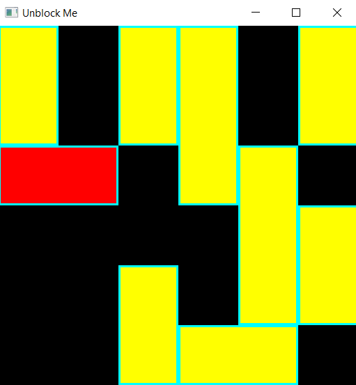

# <span style="color:orange;">Unblock Me</span>

How to install libsfml:  
```console
sudo apt-get install libsfml-dev
```


How to run game:  
```console
make play
```
<p align="center">

</p>

How to play game:  
* Use your mouse to select a block  
* Use keyboard arrow to move (length-direct)  

Reference and setup tutorial from: https://www.sfml-dev.org/tutorials/2.5/start-linux.php
